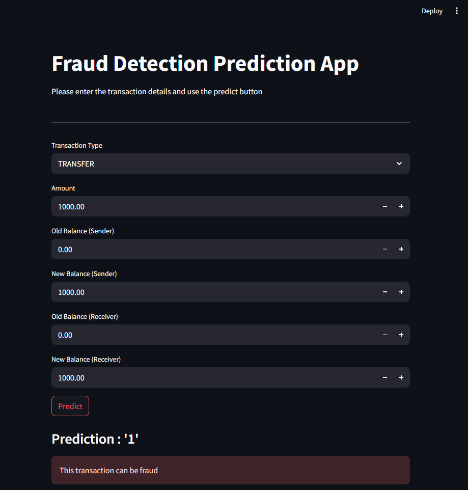
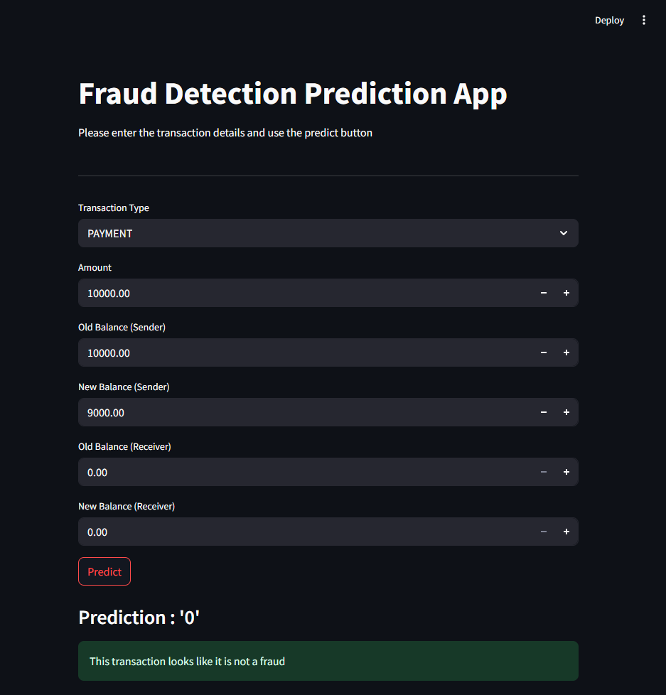

# Fraud Detection System

## Overview
This project implements a sophisticated fraud detection system using machine learning techniques to identify and prevent fraudulent activities. The system analyzes patterns and anomalies in transaction data to provide accurate fraud predictions. The project includes both a Jupyter notebook for model development and a Streamlit web application for real-time fraud detection.
 
## Features
- Advanced machine learning models for fraud detection
- Real-time transaction analysis through a web interface
- Pattern recognition and anomaly detection
- High accuracy prediction system
- Interactive data visualization
- User-friendly web application for transaction verification

## Project Structure
```
Fraud Detection/
├── analysis_model.ipynb           # Main analysis and model implementation
├── fraud_detection.py            # Streamlit web application
├── fraud_detection_pipeline.pkl   # Trained model pipeline
├── requirements.txt              # Project dependencies
└── README.md                     # Project documentation
```

## Dataset
The project uses a financial transaction dataset that includes the following features:
- Transaction type (PAYMENT, TRANSFER, CASH_OUT, DEPOSIT)
- Transaction amount
- Old balance (Sender)
- New balance (Sender)
- Old balance (Receiver)
- New balance (Receiver)

## Installation
1. Clone the repository:
```bash
git clone [repository-url]
cd Fraud-Detection
```

2. Install the required dependencies:
```bash
pip install -r requirements.txt
```

## Usage
### Web Application
1. Run the Streamlit web application:
```bash
streamlit run fraud_detection.py
```

2. Use the web interface to:
   - Enter transaction details
   - Get real-time fraud predictions
   - View prediction results

### Model Development
1. Open and run the Jupyter notebook:
```bash
jupyter notebook analysis_model.ipynb
```

2. Follow the instructions in the notebook to:
   - Load and preprocess the data
   - Train the model
   - Make predictions
   - Visualize results

## Project Media
### Screenshots



### Demo Video


## Contact Information
For any inquiries or collaboration opportunities, please reach out:

- Email: makoflash05@gmail.com
- LinkedIn: [https://www.linkedin.com/in/Michael-Micah003/]

## Acknowledgments
Thanks to Data Science with Onur youtube channel
[https://youtu.be/4Od5_z28iIE?si=q9E-CTOILSFF0Dqo]